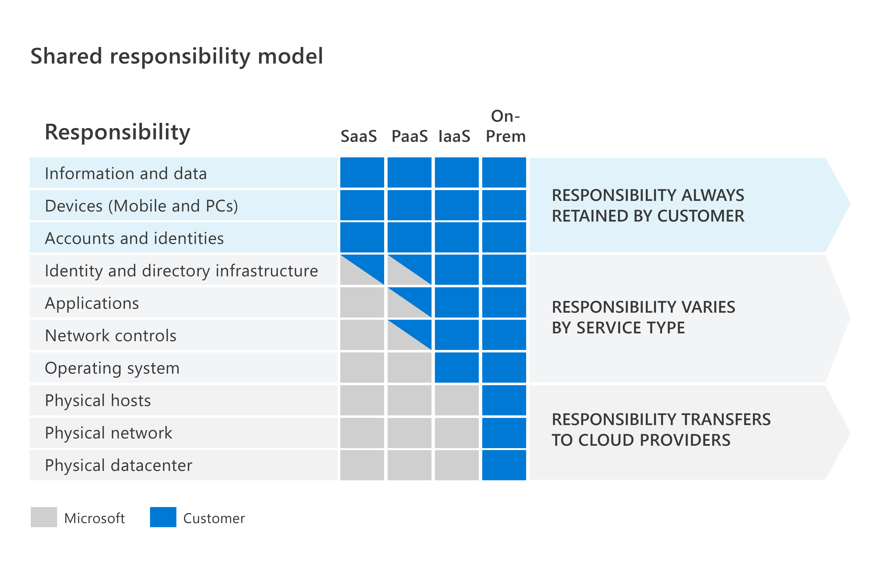

# Describe the shared responsibility model

[Describe the shared responsibility model](https://docs.microsoft.com/en-us/learn/modules/describe-security-concepts-methodologies/3-describe-shared-responsibility-model)

The Shared responsibility model details which security tasks are handled by the cloud provider (Microsoft), and which are handled by the customer (You)

For on prem solutions: All responsibility is on customer.
Also: Data, Devices and Accounts is always the responsibility of the customer.

The following image summarizes the Shared responsibility model:

[Return to Security, Compliance and Identity](README.md)

[Return to Table of Contents](../README.md)