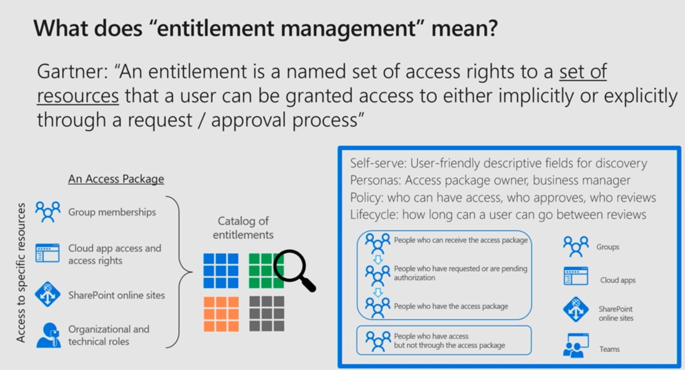

# Describe what entitlement management and access reviews is

[Describe what entitlement management and access reviews is](https://docs.microsoft.com/en-us/learn/modules/describe-identity-protection-governance-capabilities/3-describe-what-entitlement-management-access-reviews)

## Entitlement management

> An entitlement is a named set of access rights to a set of resources that a user can be granted access to either implicitly or explicitly through a request/ approval process
> 
> -- Gartner

Vision: A new team member gets access to all required resources in one package/ one place: Teams, groups, Sharepoint sites, and more.
Entitlement management is meant to fulfil this, including:
* Self service request
    User-friendly descriptive fields for discovery Peronas: Access package owner, business manager policy
* Approval workflows, including delegation of package creation to nonadministrators
* Expiration policies
* Access for external users: After having been approved, they are added to your directory (See also [B2B](14-Describe%20the%20different%20external%20identity%20types.md))

Entitlement management requires Azure AD Premium P2.

## Azure AD access reviews

An access review is basically to check if users and guests are set up correctly, and doesn't have to much access.
* Can be configured through Azure AD access reviews, or through PIM.
* Admins who create access reviews can track progress.
* No access rights are changed until the review is completed, but the review can be stopped
* Reviews can be manually applied, or auto-applied, except for dynamic groups or on-prem groups.

Access reviews requires Azure AD Premium P2.

See also [Access reviews in the AZ-500 study guide](https://github.com/JonThomas/Azure-AZ-500-Study-Guide/blob/master/1-Manage%20identity%20and%20access/22-Configure%20Access%20Reviews.md)

## Azure AD terms of use

A Terms of use statement can be presentet to employees or guests in the following situations:
* Before accessing sensitive data or an application
* On an recurring schedule
* In different languages
* Based on user attributes, for example terms applicable to certain roles

Admins can review who has accepted or declined reviews.

[Return to Microsoft Identity and Access Management Solutions](README.md)

[Return to Table of Contents](../README.md)