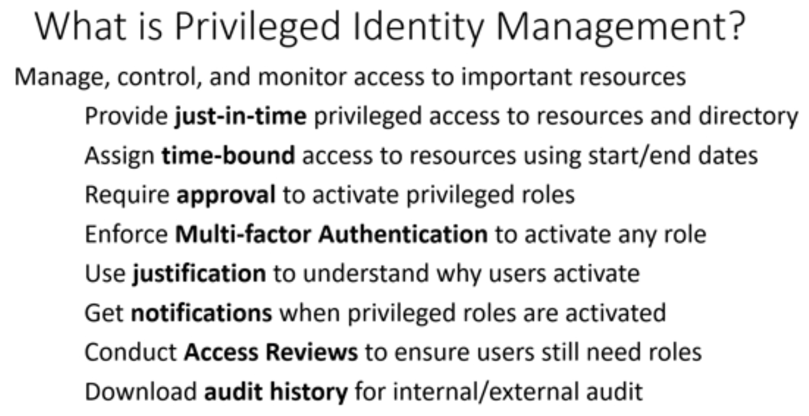

# Describe the capabilities of PIM

[Describe the capabilities of PIM](https://docs.microsoft.com/en-us/learn/modules/describe-identity-protection-governance-capabilities/4-describe-privileged-identity-management)

Privileged Identity Management (PIM) allows you to montitor, manage and control access to important resources in your organization.

Resources that can be managed by PIM include:
* Azure AD
* AD
* Microsoft 365
* Microsoft Intune

PIM is:
* Just in time
    * The access has bo be activated within a period (0 to 24 hours)
    * Time-bound access to resources, using start/ end dates. Especially useful when having guest accounts
* Privileged Admin Workflow
    * Justification of why access is required, by having approval of resource access
    * Notifications
    * Access reviews
* Audit-ready
    * Keeps track of all events
    * Can download audit history
    * Can set up customized alerts

See also [PIM in the AZ-500 study guide](https://github.com/JonThomas/Azure-AZ-500-Study-Guide/blob/master/1-Manage%20identity%20and%20access/23-Configure%20Azure%20AD%20Privileged%20Identity%20Management%20(PIM).md)

(Is PIM mostly for "important resources"??)

PIM requires Azure AD Premium P2.

[Return to Microsoft Identity and Access Management Solutions](README.md)

[Return to Table of Contents](../README.md)