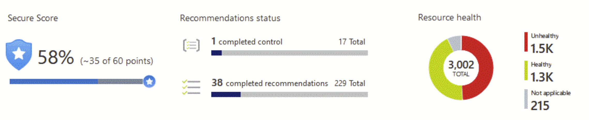

# Describe Microsoft Defender for Cloud

[Describe Microsoft Defender for Cloud](https://docs.microsoft.com/en-us/learn/modules/describe-security-management-capabilities-of-azure/3-describe-defender-cloud)

Microsoft Defender for Cloud (aka Azure Defender) protects workloads running in Azure, hybrid, and other cloud platforms:
* Continually assess: Know your security posture, identify and track vulnerabilities
* Secure: Harden resources and services
* Defend: Detect and resolve threats

## Cloud security posture management

* Visibility 
    * Secure score
    
    * Network map
* Hardenings guidance

## Defender plans

These plans can be enabled independently:

* Microsoft Defender for servers - Windows and Linux machines.
* Microsoft Defender for App Service - identifies attacks targeting applications running over App Service.
* Microsoft Defender for Storage - detects potentially harmful activity on your Azure Storage accounts.
* Microsoft Defender for SQL - secures your databases and their data wherever they're located.
* Microsoft Defender for Kubernetes
* Microsoft Defender for container registries - protects all the Azure Resource Manager based registries.
* Microsoft Defender for Resource Manager - automatically monitors the resource management operations in your organization.
* Microsoft Defender for Key Vault
* Microsoft Defender for DNS
* Microsoft Defender for open-source relational protections - threat protections for open-source relational databases.

[Return to Microsoft Security Solutions](README.md)

[Return to Table of Contents](../README.md)