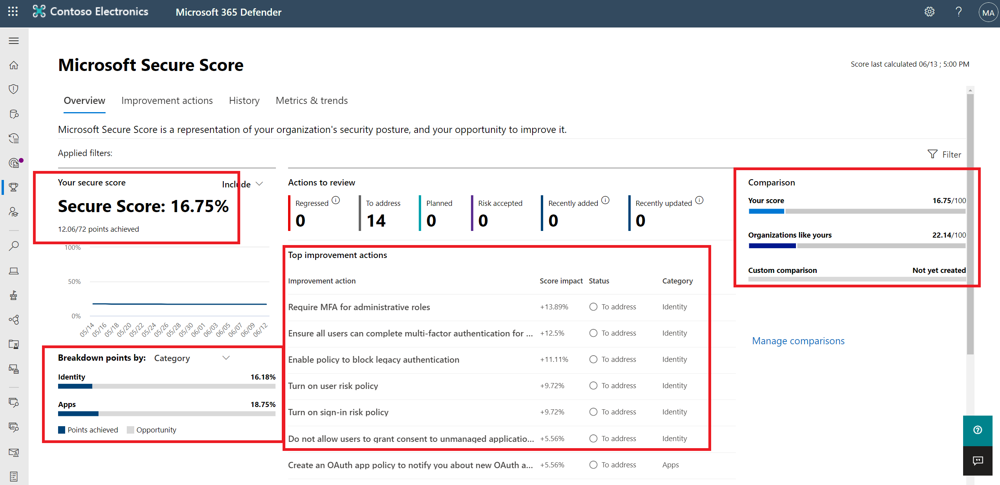

# Describe how to use Microsoft Secure Score

[Describe how to use Microsoft Secure Score](https://docs.microsoft.com/en-us/learn/modules/describe-security-management-capabilities-of-microsoft-365/3-describe-how-to-use-microsoft-secure-score)

Microsoft Secure Score supports:
* Microsoft 365 (including Exhange online)
* Azure Active Directory
* Microsoft Defender for Endpoint
* Microsoft Defender for Identity
* Cloud App Security

* The higher the score, the better your protection
* Secure Score will show all possible improvements for the product, whatever the license edition, subscription, or plan

## Differences between Microsoft 365 and Microsoft Defender For Cloud Secure Score

* Secure score in the Microsoft 365 Defender portal is a measure of the security posture of the organization across your apps, devices, and identities.
    * Improvement steps are called "improvement actions"
* Secure score in Microsoft Defender for Cloud is a measure of the security posture of your Azure subscriptions
    * Improvement steps are called "security recommendations" and they're grouped into security controls.
    * Scores are assessed for each subscription

[Return to Microsoft Security Solutions](README.md)

[Return to Table of Contents](../README.md)