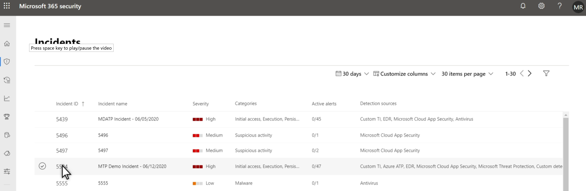
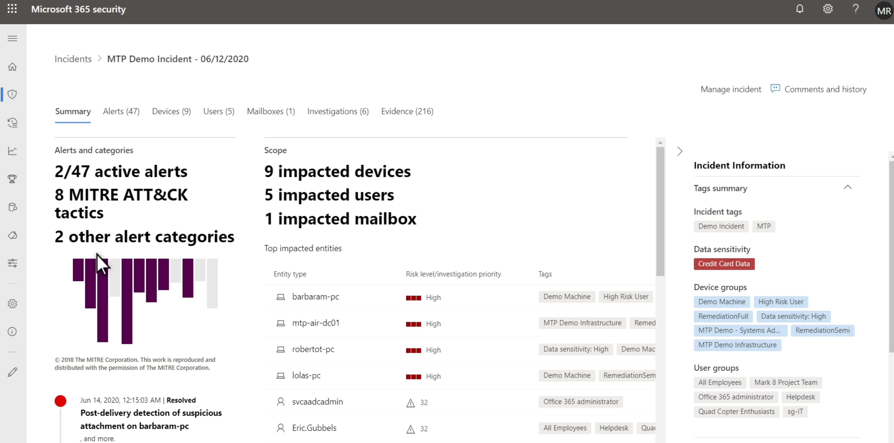

# Describe incidents and incident management capabilities

[Describe incidents and incident management capabilities](https://docs.microsoft.com/en-us/learn/modules/describe-security-management-capabilities-of-microsoft-365/5-describe-incidents-capabilities)

* It's the grouping of related alerts that form an incident. 
* The incident provides a comprehensive view and context of an attack.
* Incidents are automatically assigned a name based on an alert.
* In Microsoft 365 Defender, you can manage incidents on devices, users accounts, and mailboxes.

[Return to Microsoft Security Solutions](README.md)

[Return to Table of Contents](../README.md)