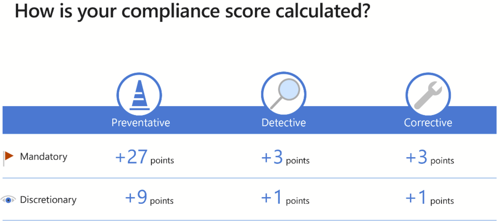

# Describe use and benefits of compliance score

[Describe use and benefits of compliance score](https://docs.microsoft.com/en-us/learn/modules/describe-compliance-management-capabilities-microsoft/5-describe-use-benefits-of-compliance-score])

* The compliance score is part of the [Compliance Manager](14-Describe-compliance-manager.md) (which is part of the [Compliance Center](13-Describe-the-compliance-center.md))
* Helps organizations understand current security posture
* Helps organizations prioritize actions

## Compliance score calculation

The Compliance score is calculated based on how many actions have been completed:
* Your actions (Actions that the organization have to complete)
* Microsoft actions (Actions that Microsoft manages)

Action categories:
* Mandatory (example: Enforce a password policy)
    * Preventative - to handle spesific risk. Example: Use encryption (**27 points**)
    * Detective - to monitor. Example: Audits  (**3 points**)
    * Corrective - fixing issues (**3 points**)
* Discretionary (example: Users must lock device before they leave it)
    * Preventative (**9 points**)
    * Detective (**1 point**)
    * Corrective - fixing issues  (**1 point**)

[Return to Microsoft Compliance Solutions](README.md)

[Return to Table of Contents](../README.md)