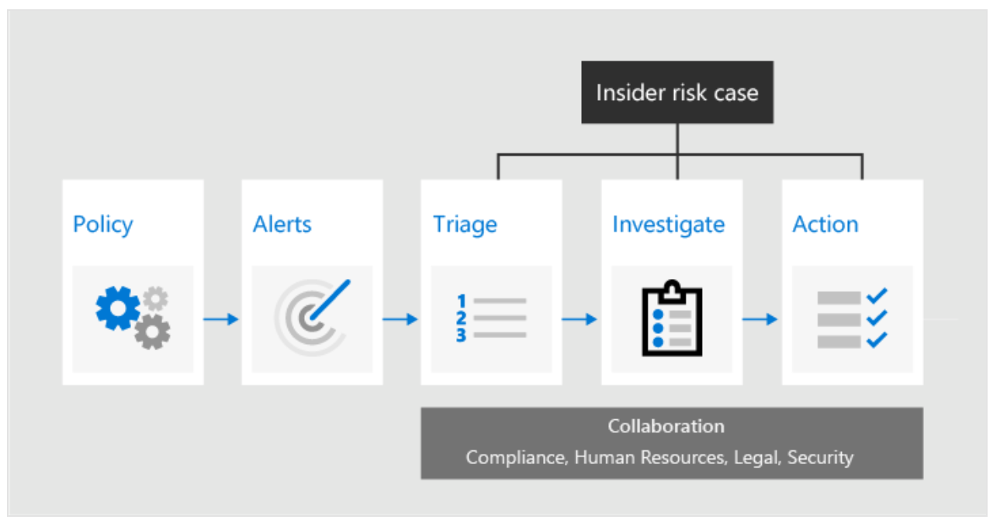

# Describe Insider risk management solution

[Describe Insider risk management solution](https://docs.microsoft.com/en-us/learn/modules/describe-insider-risk-capabilities-microsoft-365/2-management-solution)

A part of **Microsoft 365**

## Common risks
* Data theft
* Leak of confidential information
* Offensive behaiour
* Insider trading

## Insider Risk Management Workflow
* Policy
    * Created using predefined templates and conditions that define what risk indicators are examined in Microsoft 365
* Alerts
    * Displayed in the Alerts dashboard
* Triage
    * New alerts are assigned *Needs review* status
    * Reviewers can view alert details, user activity, see severity of the alert, and review user profile
* Investigate
    * Cases are created, when alerts require deeper review, and can be reviewed in teh Case dashboard.
* Action
    * Example actions: 
        * Send a notification to an employee
        * Share case information with other reviewers. Transfer to "Advanced eDiscovery" in Microsoft 365

[Return to Microsoft Compliance Solutions](README.md)

[Return to Table of Contents](../README.md)